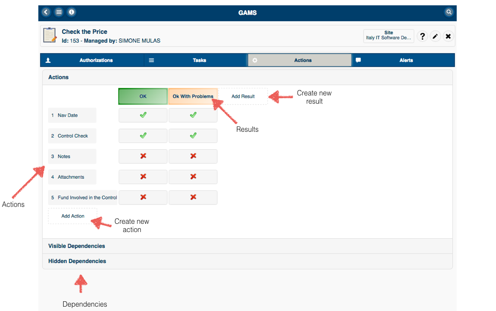
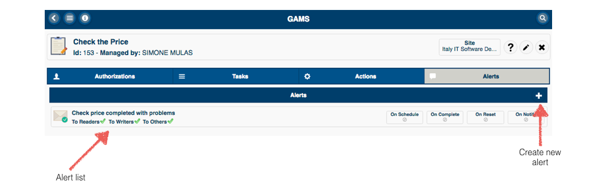
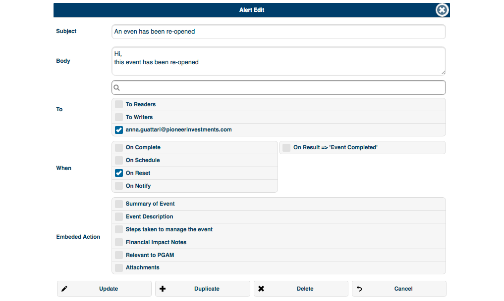

# GAMS User Manual

## Dashboard

> The entry point of GAMS is the dashboad, it includes all the available widget granted to the connected user.

## Activities
> The __Activities__ widget shows the list of activities available to the connected user.

Click on one activity in the list to get to the __Activity Editor__ or click on "__+__" (_top right_) to create a new one.

## Activity Header
> The Header of an activity is always visible in the activity editor

> An activity belong to a site (i.e. Global Operational Risk Management) but can also be used by users of other sites if they are granted.

The context button on the right allow to:

1. Access the tutorial
2. Edit the activity (rename and/or change the site)
3. Delete the activity

## Activity Authorizations
> The Activity Authorizations panel is used to grant users to read, edit or authorize tasks for the current activity. 

To grant a new user or group click on the "__+__" button on the top right, a modal dialog will appear where it's possible to search by name for a user or a group.

There are three kind of authorization:

Authorization | Description
--------------|--------------------------------------------------------------------
Read          | Readonly access to the activity 
Edit          | Write access, it's possible to modify the activity
Authorize Task| It's only possible to assign authorizations to the activity tasks

If no flag is enabled, the selected user/group will be removed from the list.

> __NB: This authorizations affects the activity, not the works!__

## Activity Tasks
> A Task is an instance of the activity that defines who and when the work should be done.

An activity can have one or more tasks, click on "__+__" to create a new task.

## Task Header
> The Header of a task is always visible in the task editor

> The task is where it's possible to define _when_ the work should be done and _who_ is assigned to the job.

The context button on the right allow to:

1. Force the schedulation of the task
2. Edit the task 
3. Delete the task

## Editing a task

> The task editor allow to change the properties of the task, changes will effect only future works.

Property                   | Description
---------------------------|---------------------------------------
Name                       | The task name 
On demand                  | If __YES__ the task can be scheduled on demand
Advance in schedule        | How many days before the reference date the work will be visible to the users
Expired offset             | Number of days needed (after the reference date) to change the work state to __Expired__  (if not completed.)

## Task authorizations
> The Task Authorizations panel is used to grant users to read, edit, rollback or delete expired work

To grant a new user or group click on the "__+__" button on the top right, a modal dialog will appear where it's possible to search by name for a user or a group.

There are for kind of authorization:

Authorization | Description
--------------|--------------------------------------------------------------------
Read          | Readonly access to the work 
Edit          | Write access, it's possible to edit and complete the work
Rollback      | it's possible to reset the state of the work and optionally to clear all fields.
Expire        | it's possible to purge the work if it's expired

## Task schedulation
> The Task Schedulation panel is used to define the schedulation rule of the work.

## Activity Actions
> The Activity action panel is used to define the content of a work (fields) and its behavior (results)

## Activity Alerts
> The Alert panel is used to define one or more alerts

